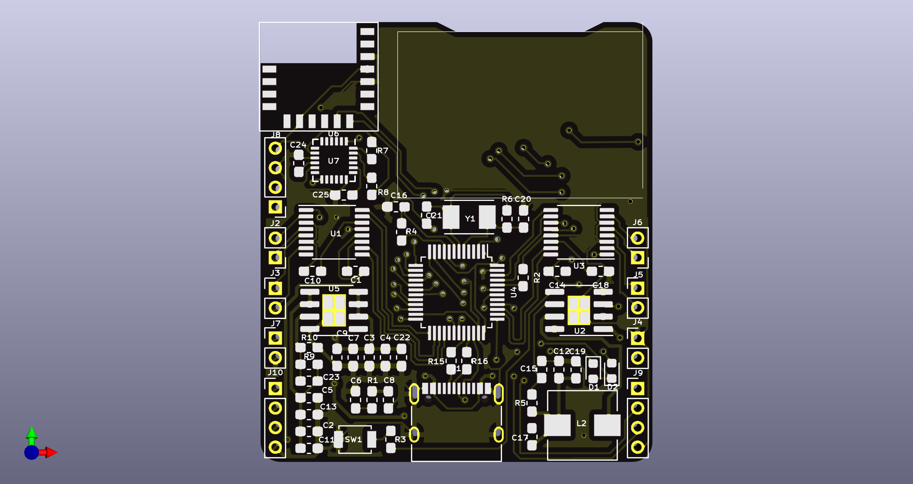

# QuadoFly
>
#### 尺寸40*45mm
#### stm32f103主控
#### IP5306集成电池充放电管理和升压输出
#### 双DRV8833输出
#### 4通道pwm
#### MPU6050
#### 0.96寸OLED接口
#### 板载一个蓝牙模块
#### 引出一路GPIO，一路IIC

### 软件开发中，板子可以做得更迷你，更多是将这个板子作为无人机，遥控车的开发板，所以引出多个接口，板子体积增大，待软硬完善后再重新设计专用的板子...
